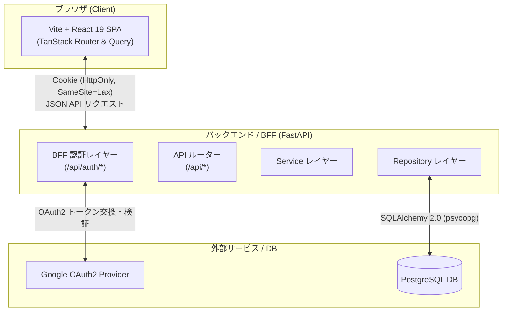
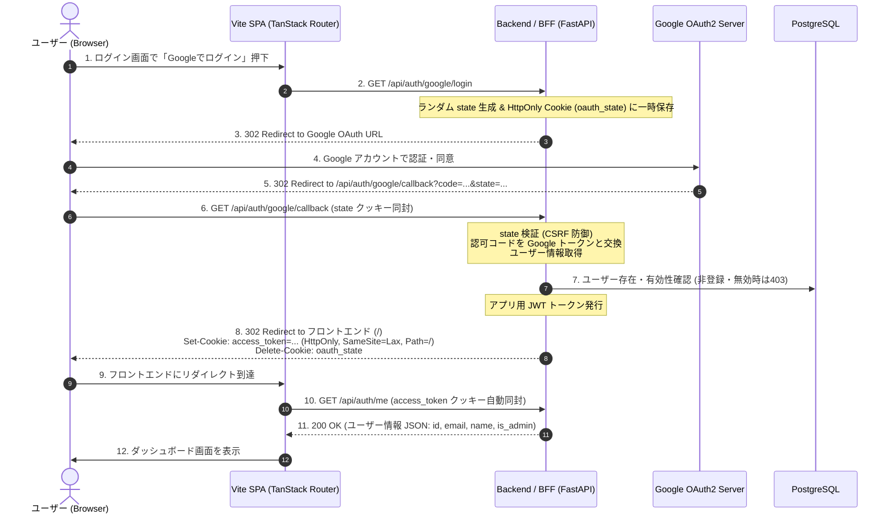

# 新アーキテクチャ 設計・開発・運用ガイドライン

本ドキュメントは、`ynym-portal` における新アーキテクチャ（フロントエンド: Vite + TanStack Router + TanStack Query / バックエンド: FastAPI による BFF 認証）の設計方針、開発手順、および本番運用指針を網羅的に定めたガイドラインです。

---

## 目次

1. [アーキテクチャ概要](#1-アーキテクチャ概要)
   - [1.1 刷新の背景と目的](#11-刷新の背景と目的)
   - [1.2 全体システム構成図](#12-全体システム構成図)
   - [1.3 技術スタック一覧](#13-技術スタック一覧)
2. [設計ガイドライン (Design)](#2-設計ガイドライン-design)
   - [2.1 BFF (Backend for Frontend) 認証設計](#21-bff-backend-for-frontend-認証設計)
   - [2.2 フロントエンド設計 (Vite + TanStack)](#22-フロントエンド設計-vite--tanstack)
   - [2.3 バックエンド設計 (FastAPI)](#23-バックエンド設計-fastapi)
   - [2.4 API 通信・型定義設計](#24-api-通信型定義設計)
3. [開発ガイドライン (Development)](#3-開発ガイドライン-development)
   - [3.1 開発環境セットアップ](#31-開発環境セットアップ)
   - [3.2 ローカル開発フローとプロキシ](#32-ローカル開発フローとプロキシ)
   - [3.3 ディレクトリ構成規則](#33-ディレクトリ構成規則)
   - [3.4 実装・コーディング規約](#34-実装コーディング規約)
   - [3.5 品質保証 (テスト・リント・フォーマット)](#35-品質保証-テストリントフォーマット)
4. [運用ガイドライン (Operations)](#4-運用ガイドライン-operations)
   - [4.1 ビルド & コンテナ化](#41-ビルド--コンテナ化)
   - [4.2 本番ネットワーク & ドメイン・Cookie 設計](#42-本番ネットワーク--ドメインcookie-設計)
   - [4.3 オブザーバビリティ (ロギング・監視)](#43-オブザーバビリティ-ロギング監視)
   - [4.4 セキュリティ運用 & シークレット管理](#44-セキュリティ運用--シークレット管理)

---

## 1. アーキテクチャ概要

### 1.1 刷新の背景と目的

- **フロントエンドの責務明確化と開発体験 (DX) の向上**:
  Next.js (App Router / SSR) から純粋な Vite SPA へ移行することで、ビルド速度・HMR（Hot Module Replacement）の高速化とバンドルサイズの最適化を実現します。
- **強固な型安全性とルート制御**:
  TanStack Router による完全型安全ルーティングと `beforeLoad` ガードを採用し、ルーティングレベルでの宣言的認証保護を実現します。
- **サーバー状態管理の標準化**:
  TanStack Query (`@tanstack/react-query`) を導入し、データキャッシュ、バックグラウンド更新、楽観的更新（Optimistic Updates）を統一。各コンポーネントの手動 `useState`/`useEffect` ボイラープレートを排除します。
- **BFF パターンによるセキュアな認証**:
  SPA クライアント側で Google OAuth トークンや秘密情報を直接保持せず、バックエンド（FastAPI）を BFF として位置づけ、セッションおよび HttpOnly Cookie を一元管理します。

### 1.2 全体システム構成図



### 1.3 技術スタック一覧

| 区分 | 技術 / ライブラリ | バージョン / 用途 |
| :--- | :--- | :--- |
| **フロントエンド基盤** | React | 19.x (最新 React 機能) |
| **ビルドツール** | Vite | 6.x (高速ビルド & 開発サーバー) |
| **ルーティング** | TanStack Router | `@tanstack/react-router` (型安全ルーティング) |
| **データフェッチ/キャッシュ** | TanStack Query | `@tanstack/react-query` v5 |
| **スタイリング** | Tailwind CSS | v4 (`@tailwindcss/vite`) |
| **UI コンポーネント** | shadcn/ui (Base UI) | コンポーネントライブラリ（直接改変禁止） |
| **バックエンド基盤** | FastAPI | Python 3.12 (uv 管理) |
| **ORM / DB** | SQLAlchemy 2.0 | `psycopg` (PostgreSQL 16) |
| **型定義** | TypeScript | `src/lib/types/` 配下で手動定義・管理 |

---

## 2. 設計ガイドライン (Design)

### 2.1 BFF (Backend for Frontend) 認証設計

SPA において認証トークン（JWT等）を `localStorage` やメモリ内に直接保持することは、XSS 攻撃によるトークン漏洩リスクを伴います。本システムでは **BFF パターン** を採用し、FastAPI がフロントエンド専用の認証プロキシ・セッションハンドラーとして振る舞います。

#### 認証シーケンス図 (Google OAuth2 + HttpOnly Cookie)



#### BFF 認証エンドポイント仕様

| メソッド | パス | 役割 | 認証必須 |
| :--- | :--- | :--- | :--- |
| `GET` | `/api/auth/google/login` | Google OAuth 認証開始。state 発行と Google 認可画面へのリダイレクト | 不要 |
| `GET` | `/api/auth/google/callback` | Google コールバック処理。code 検証、JWT 発行、`access_token` Cookie 付与 | 不要 |
| `GET` | `/api/auth/me` | 現在のセッション（Cookie）からログイン中ユーザー情報を返却（未認証は 401） | 必須 |
| `POST` | `/api/auth/logout` | セッション終了。`access_token` Cookie を削除 | 必須 |

#### Cookie セキュリティ属性規約
- **`HttpOnly`**: `True` (JavaScript からの読み取りを完全遮断し XSS 対策)
- **`SameSite`**: `Lax` (外部サイトからの CSRF を防御しつつ、OAuth コールバック等の安全なトップレベルナビゲーションを許可)
- **`Secure`**: 本番環境 (`production`) では `True`（HTTPS のみ送信）。開発環境 (`localhost`) では `False`
- **`Path`**: `/`

---

### 2.2 フロントエンド設計 (Vite + TanStack)

#### 1. TanStack Router 設計

ファイルベースルーティング（`@tanstack/router-plugin/vite`）を採用します。ルート定義と型定義は自動生成されます。

```text
frontend/src/routes/
├── __root.tsx                    # 全体ルート (QueryClientProvider, Toaster, DevTools)
├── auth.tsx                      # ログイン画面 (/auth)
├── _authenticated.tsx            # 認証必須レイアウト (beforeLoad ガード, Sidebar, Header)
└── _authenticated/
    ├── index.tsx                 # ダッシュボードトップ (/)
    ├── tasks.tsx                 # タスク管理 (/tasks)
    ├── todos.tsx                 # TODO管理 (/todos)
    ├── notes.tsx                 # ノート管理 (/notes)
    ├── note-categories.tsx       # カテゴリ管理 (/note-categories)
    ├── fuel-records.tsx          # 給油記録 (/fuel-records)
    ├── vehicles.tsx              # 車両管理 (/vehicles)
    ├── trash.tsx                 # ゴミ箱 (/trash)
    └── users.tsx                 # ユーザー管理 (/users - 管理者限定)
```

##### 認証ガード (`beforeLoad`) の設計
`_authenticated.tsx` において、遷移前に認証状態を確認します。未認証時は `/auth` にリダイレクトし、元のパスを `redirect` クエリに保持します。

```typescript
// src/routes/_authenticated.tsx
export const Route = createFileRoute('/_authenticated')({
  beforeLoad: async ({ context, location }) => {
    try {
      // TanStack Query のキャッシュまたはフェッチでユーザー取得
      const user = await context.queryClient.ensureQueryData(authQueries.me())
      if (!user) {
        throw redirect({
          to: '/auth',
          search: { redirect: location.href },
        })
      }
      return { user }
    } catch {
      throw redirect({
        to: '/auth',
        search: { redirect: location.href },
      })
    }
  },
  component: AuthenticatedLayout,
})
```

#### 2. TanStack Query キャッシュ・状態管理設計

##### Query Key ファクトリパターン
キャッシュキーの衝突や表記揺れを防ぐため、リソースごとに Query Key ファクトリを定義します。

```typescript
// src/lib/query-keys.ts
export const taskKeys = {
  all: ['tasks'] as const,
  lists: () => [...taskKeys.all, 'list'] as const,
  list: (filter: TaskFilter) => [...taskKeys.lists(), { filter }] as const,
  details: () => [...taskKeys.all, 'detail'] as const,
  detail: (id: string) => [...taskKeys.details(), id] as const,
}
```

##### 楽観的更新 (Optimistic Updates) の標準化
タスクの完了トグルなど頻繁に操作される UI は、サーバー応答を待たずに即座に UI を更新し、失敗時にロールバックする `onMutate` パターンを適用します。

#### 3. shadcn/ui 利用規約（重要）

> [!CAUTION]
> **shadcn/ui コンポーネントの直接編集禁止**
> - `src/components/ui/` 配下のコンポーネントは、shadcn/ui 公式 CLI によって生成・管理されます。
> - ソースコードを直接書き換えることは禁止です。
> - スタイルや挙動の調整は、呼び出し元コンポーネントの props（`className`, `render`, `nativeButton={false}` 等）で行ってください。

---

### 2.3 バックエンド設計 (FastAPI)

FastAPI 側はクリーンなレイヤードアーキテクチャを維持します。

```text
backend/app/
├── routers/        # HTTP リクエスト受付、BFF 認証、レスポンス定義
├── services/       # ビジネスロジック、OAuth トークン交換処理
├── repositories/   # SQLAlchemy 2.0 によるデータアクセス・クエリ実行
├── models/         # DB テーブル定義 (SQLModel / SQLAlchemy)
├── schemas/        # Pydantic v2 入出力スキーマ
└── security/       # JWT トークン検証、Cookie 抽出 deps
```

- **依存性注入 (DI)**: `CurrentUser = Annotated[User, Depends(get_current_user)]` により、各 API エンドポイントで宣言的に Cookie 認証を適用。
- **管理者ガード**: `CurrentAdminUser = Annotated[User, Depends(get_current_admin_user)]` により、管理権限を透過的に検証。

---

### 2.4 API 通信・型定義設計

1. **API パス統一**: バックエンドのルーターはすべて `/api` プレフィックス配下に集約（例: `/api/tasks`, `/api/auth/me`）。
2. **型定義管理**:
   - バックエンド（FastAPI / Pydantic）のスキーマに対応する TypeScript 型を `frontend/src/lib/types/` 配下に手動で明示的に定義・管理します。
   - 共通レスポンス構造（`SuccessResponse<T>`, `MessageResponse`, `ErrorResponse`）をベースに、型安全な API 通信を実現します。

---

## 3. 開発ガイドライン (Development)

### 3.1 開発環境セットアップ

本プロジェクトは **asdf** を使用してランタイムバージョンを統一しています（`mise` は使用しません）。

- **Node.js**: `24.19.0` (または `.tool-versions` 指定のバージョン)
- **Python**: `3.12.x` (uv によるパッケージ管理)
- **Docker / PostgreSQL**: ローカル検証用 DB

```bash
# 依存関係のインストール (ルートで実行)
make install
```

### 3.2 ローカル開発フローとプロキシ

Vite SPA 開発時 (`localhost:3000`) と FastAPI 開発時 (`localhost:8000`) で、Cookie のクロスオリジン制約を回避するため、**Vite のリバースプロキシ機能** を利用します。

```typescript
// frontend/vite.config.ts
export default defineConfig({
  plugins: [
    react(),
    tailwindcss(),
    TanStackRouterVite(),
  ],
  server: {
    port: 3000,
    proxy: {
      '/api': {
        target: 'http://localhost:8000',
        changeOrigin: true,
        secure: false,
      },
    },
  },
})
```

これにより、フロントエンドからは相対パス `/api/...` でリクエストを送信でき、ブラウザにとっては同一オリジンとなるため、Cookie のやり取りが完全かつ安全に動作します。

### 3.3 ディレクトリ構成規則

```text
ynym-portal/
├── backend/                      # FastAPI バックエンド
│   ├── app/                      # アプリケーションコード
│   ├── migrations/               # SQL マイグレーション
│   ├── tests/                    # pytest テスト
│   ├── pyproject.toml            # uv 設定
│   └── .env                      # バックエンド環境変数
├── frontend/                     # Vite フロントエンド
│   ├── src/
│   │   ├── components/           # UI コンポーネント (ui/, features/)
│   │   ├── hooks/                # TanStack Query & カスタムフック
│   │   ├── lib/                  # API クライアント, 型定義, ユーティリティ
│   │   ├── routes/               # TanStack Router ルートファイル
│   │   ├── main.tsx              # エントリポイント
│   │   └── index.css             # グローバルスタイル (Tailwind CSS v4)
│   ├── index.html                # SPA HTML
│   ├── vite.config.ts            # Vite 設定
│   ├── package.json
│   └── .env.local                # フロントエンド環境変数
├── docs/                         # プロジェクトドキュメント
├── Makefile                      # ルートタスクランナー
└── AGENTS.md                     # AI エージェント共通指示書
```

### 3.4 実装・コーディング規約

- **言語**: 日本語でコメントおよびドキュメントを記述する。
- **Git コミットメッセージ規約**:
  - フォーマット: `タグ: コミットメッセージ` (例: `feature: タスク一覧のTanStack Query化`)
  - タグ: `feature`, `fix`, `refactor`, `docs`
  - 文字数: **50文字以内**、**日本語** で記述。
- **コンポーネント実装規約**:
  - 1 ファイル 1 コンポーネントを基本とする。
  - データ取得ロジックはコンポーネント内に直接書かず、`src/hooks/queries/` 配下のカスタムフック経由で呼び出す。

### 3.5 品質保証 (テスト・リント・フォーマット)

Makefile によりコマンドが統一されています。CI でも同一のコマンドが実行されます。

| 対象 | リント | フォーマットチェック | 自動整形 | テスト / 型チェック |
| :--- | :--- | :--- | :--- | :--- |
| **全体** | `make lint` | `make format-check` | `make format` | `make test` |
| **バックエンド** | `make lint-backend` (ruff) | `make format-check-backend` | `make format-backend` | `make test-backend` (pytest) |
| **フロントエンド** | `make lint-frontend` (eslint) | `make format-check-frontend` | `make format-frontend` | `make test-frontend` (tsc & build) |

---

## 4. 運用ガイドライン (Operations)

### 4.1 ビルド & コンテナ化

フロントエンドは SPA であるため、ビルド成果物は純粋な静的ファイル（HTML, JS, CSS, 画像）となります。

#### フロントエンド Dockerfile (マルチステージビルド)

```dockerfile
# Stage 1: Build
FROM node:24-alpine AS builder
WORKDIR /app
COPY package*.json ./
RUN npm ci
COPY . .
RUN npm run build

# Stage 2: Serve (Nginx による静的ホスティング & プロキシ)
FROM nginx:alpine AS runner
COPY --from=builder /app/dist /usr/share/nginx/html
COPY nginx.conf /etc/nginx/conf.d/default.conf
EXPOSE 80
CMD ["nginx", "-g", "daemon off;"]
```

> **SPA ルーティング設定 (nginx.conf)**:
> 直接 URL アクセスやリロード時に 404 とならないよう、`try_files $uri $uri/ /index.html;` のフォールバックを設定します。

### 4.2 本番ネットワーク & ドメイン・Cookie 設計

本番環境におけるフロントエンドとバックエンドの構成パターンは以下のいずれかを採用します。

#### パターン A: 同一ドメイン / リバースプロキシ構成（推奨）
Cloudflare、ALB、または Nginx 等のリバースプロキシを前段に配置。
- `https://portal.example.com/` → フロントエンド静的アセット
- `https://portal.example.com/api/` → FastAPI バックエンド

**メリット**: 完全同一オリジンのため、Cookie の `SameSite=Lax`、`Secure=True` が最もセキュアかつ設定の齟齬なく動作します。

#### パターン B: サブドメイン分離構成
- フロントエンド: `https://app.example.com`
- バックエンド: `https://api.example.com`

**要件**:
- FastAPI 側で `Set-Cookie` 時に `Domain=.example.com` を付与。
- CORS 設定で `allow_origins=["https://app.example.com"]`, `allow_credentials=True` を必須設定。

### 4.3 オブザーバビリティ (ロギング・監視)

- **バックエンドログ**:
  - `LoggingMiddleware` により、すべての `/api` リクエストのメソッド、パス、ステータスコード、処理時間を記録。
  - 機密情報（Cookie 値、OAuth トークン等）はログに出力しないようマスキング。
- **ヘルスチェック**:
  - バックエンド: `/api/health`（DB 死活監視を含む）を提供し、ロードバランサーのヘルスチェックターゲットとする。
- **フロントエンドのエラー境界**:
  - TanStack Router の `defaultErrorComponent` や React 19 の Error Boundary を使用し、予期せぬランタイムエラー発生時にもユーザーフレンドリーな復旧画面を表示。

### 4.4 セキュリティ運用 & シークレット管理

1. **環境変数の厳格管理**:
   - `JWT_SECRET_KEY`, `GOOGLE_CLIENT_SECRET`, DB 接続情報は決してリポジトリにコミットしない。
   - 本番環境では AWS Secrets Manager、GCP Secret Manager、または環境変数注入機能を利用。
2. **Google OAuth 認証情報の管理**:
   - Google Cloud Console の「承認済みのリダイレクト URI」に、本番・ステージング・ローカルの各コールバック URL を過不足なく登録。
   - クライアントシークレットの定期ローテーション手順を策定。
3. **セッション失効・無効化**:
   - ユーザー論理削除時、またはロール変更時は即座に JWT 検証で弾かれるよう、`deps.py` の `get_current_user` で毎回 DB の有効フラグ（`deleted_at is None`）を確認。
